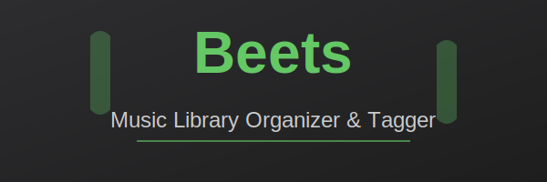

# Beets - Home Assistant Addon

## About

Beets is a music library organizer and tagger. It catalogs your collection and helps you organize and manage your music files with powerful metadata tagging and organization capabilities.

### Key Features

- **Automatic Tagging**: Identify and tag music using acousticIDs and music databases
- **Library Organization**: Automatically organize music into customizable directory structures
- **Plugin System**: Extend functionality with powerful plugins (Acousticbrainz, Spotify, Lyrics, etc.)
- **Web Interface**: Browse, search, and manage your library through an intuitive web UI
- **Batch Processing**: Process entire libraries with flexible query-based operations
- **Metadata Management**: Fetch and organize metadata from multiple sources
- **Cross-Platform**: Works seamlessly with various music formats and sources
- **Music Discovery**: Discover new music and manage playlists through plugins

## Installation

1. Add this repository to Home Assistant:
   - Settings → Devices & Services → Integrations → "Create Integration" → Repositories
   - Add repository URL: `https://github.com/rezusnet/hassio-addons`

2. Install the Beets addon:
   - Settings → Add-ons → Beets → Install

3. Configure and start the addon

## Access

Once running, access the Beets web interface:
- Click "Open Web UI" in the addon panel, or
- Navigate to `http://[YOUR_HA_IP]:8337` in your browser

## Configuration

See [DOCS.md](DOCS.md) for detailed configuration options including:
- Music library paths
- Plugin configuration
- Tag sources and preferences
- Advanced options

## Upstream Project

For more information about Beets, visit [beets.io](https://beets.io/)

This addon is based on the [LinuxServer.io Beets Docker image](https://github.com/linuxserver/docker-beets).
