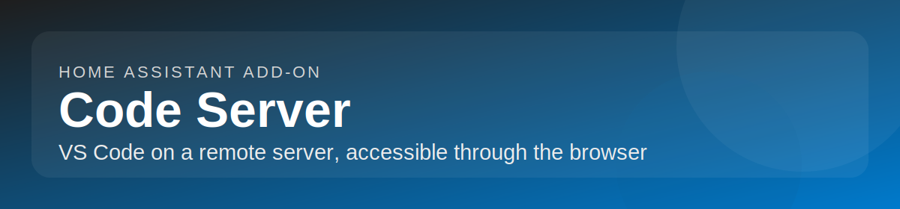

# Home Assistant add-on: Code Server

## About

[Code Server](https://coder.com) is VS Code running on a remote server, accessible through the browser.

This add-on is based on the [linuxserver/docker-code-server](https://github.com/linuxserver/docker-code-server) Docker image.

**Key features:**

- Code on your Chromebook, tablet, and laptop with a consistent dev environment
- Develop for Linux from Windows or Mac workstations
- Use cloud servers to speed up tests, compilations, and downloads
- Preserve battery life when on the go
- All intensive computation runs on your server
- Web-based IDE with the full power of VS Code
- Extensions support from the VS Code marketplace
- HA ingress sidebar support
- Optional password authentication
- SUDO support

## Installation

1. Add this repository to your Home Assistant instance:
   
2. Install the **Code Server** add-on from the add-on store.
3. Configure options (see Documentation tab).
4. Start the add-on.
5. Access via the **HA sidebar** (Ingress) or directly at `https://<your-ha-ip>:8443`.

For full configuration details and troubleshooting, see the **Documentation** tab.
