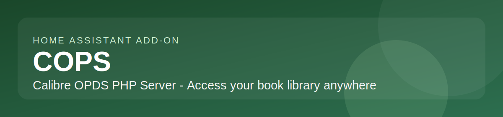

# Home Assistant add-on: COPS

## About

[COPS](https://github.com/mikespub-org/seblucas-cops) stands for Calibre OPDS (and HTML) Php Server. It links to your Calibre library database and allows downloading and emailing of books directly from a web browser and provides an OPDS feed to connect to your devices.

This add-on is based on the [linuxserver/docker-cops](https://github.com/linuxserver/docker-cops) Docker image.

**Key features:**

- Access your Calibre library via web browser
- OPDS feed support for e-readers and mobile devices
- Download and email books directly from the web interface
- Search functionality across your entire library
- Clean, responsive HTML interface
- Minimal dependencies and low resource usage
- HA ingress sidebar support
- SMB/CIFS network share mounting
- Local USB/SATA/NVMe disk mounting

## Installation

1. Add this repository to your Home Assistant instance:
   
2. Install the **COPS** add-on from the add-on store.
3. Configure your Calibre library path and options (see Documentation tab).
4. Start the add-on.
5. Access via the **HA sidebar** (Ingress) or directly at `http://<your-ha-ip>:80`.

For full configuration details and troubleshooting, see the **Documentation** tab.
