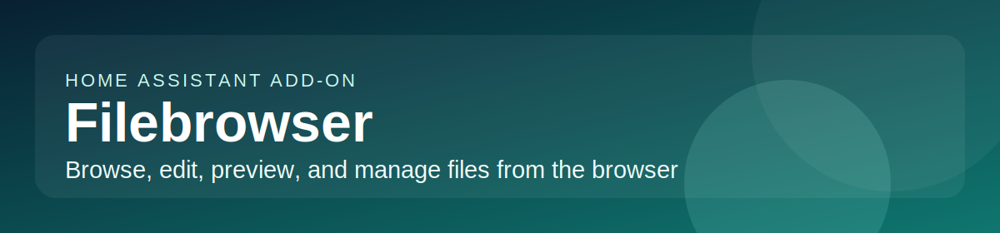

# Home Assistant add-on: Filebrowser

## About

[Filebrowser](https://filebrowser.org/) is a web-based file manager that provides a clean interface for browsing, uploading, downloading, renaming, previewing, and editing files directly from your browser.

This add-on is based on the [filebrowser/filebrowser](https://github.com/filebrowser/filebrowser) Docker image and exposes Filebrowser through Home Assistant ingress.

**Key features:**

- Browse, upload, download, rename, move, copy, and delete files from the browser
- Preview images, audio, video, and documents, and edit text files in place
- Optional authentication, user management, and HTTPS support
- Custom base folder selection for narrowing the served path
- Mount local disks and SMB/CIFS network shares
- Access Home Assistant config, media, backups, and add-on data from one UI
- HA ingress sidebar support

## Installation

1. Add this repository to your Home Assistant instance:
   
2. Install the "Filebrowser" add-on from the add-on store.
3. Configure the add-on options (see Documentation tab).
4. Start the add-on.
5. Access Filebrowser via the **HA sidebar** (Ingress) or directly at `http://<your-ha-ip>:8071`.

For full configuration details, file access, and troubleshooting, see the **Documentation** tab.
