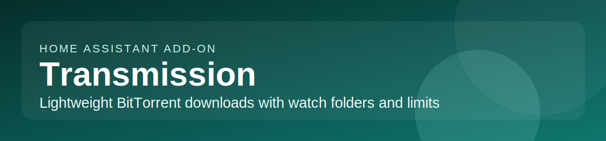

# Home Assistant add-on: Transmission

## About

[Transmission](https://transmissionbt.com/) is a fast, easy, and free BitTorrent client. It focuses on a lightweight footprint while still offering the core torrent features expected on NAS boxes, media servers, and Raspberry Pi systems.

This add-on is based on the [linuxserver/docker-transmission](https://github.com/linuxserver/docker-transmission) Docker image.

**Key features:**

- Simple and lightweight web UI
- Watch directory for automatic torrent addition
- Magnet links, DHT, PEX, uTP, UPnP/NAT-PMP, and webseed support
- Encryption, tracker editing, and global/per-torrent speed limits
- Blocklist and whitelist support for tighter control
- Low resource usage, ideal for Raspberry Pi and home servers
- Privacy-focused, open-source BitTorrent client with no ads or tracking
- HA ingress sidebar support
- SMB/CIFS network share mounting
- Local USB/SATA/NVMe disk mounting

## Installation

1. Add this repository to your Home Assistant instance:
   
2. Install the **Transmission** add-on from the add-on store.
3. Configure options (see Documentation tab).
4. Start the add-on.
5. Access via the **HA sidebar** (Ingress) or directly at `http://<your-ha-ip>:9091`.

For full configuration details, download path planning, and troubleshooting, see the **Documentation** tab.
